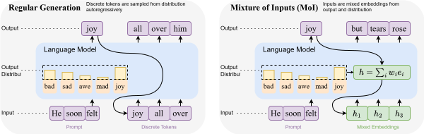

<h1 align="center">🎨 Mixture of Inputs (MoI) 🎨</h1>
<p align="center"><b>Text Generation Beyond Discrete Token Sampling</b>  
(<a href="https://arxiv.org/abs/TBD">arXiv</a>)</p>

<p align="center">
  
  
</p>

<p align="center">
  
</p>

---

## What is Mixture of Inputs?

**Mixture of Inputs (MoI)** is a simple, training-free technique to improve autoregressive text generation.

In standard LLM inference, the model samples a discrete token and discards the rich distribution used to make that choice. **MoI changes this**: after a token is sampled, we create a new input that blends the sampled token with the original distribution—preserving more information for future steps.

MoI uses Bayesian estimation:  
- Treats the distribution as a **prior**  
- Treats the sampled token as an **observation**  
- Computes the **posterior expectation** as a continuous replacement for the one-hot input

This lets the model maintain a **richer internal state** throughout generation, improving coherence, reasoning, and code synthesis.

---

## Installation

Requires `vllm >= 0.8.5`.

```bash
pip install mixinputs
mixinputs setup
```

## Quick Start
To activate MoI, set the MIXINPUTS_BETA environment variable:

```bash
export MIXINPUTS_BETA=1.0
```
Then run your usual vLLM-based generation script. That’s it!

## CLI Utilities
We provide command-line tools to patch or unpatch your environment:

```bash
# Enable MoI
mixinputs setup

# Disable MoI
mixinputs cleanup
```

## Configuration Options

| Variable         | Description                                       | Default |
| ---------------- | ------------------------------------------------- | ------- |
| `MIXINPUTS_BETA` | Controls the strength of the mixture input signal | `1.0`   |

Recommended range: 0.5 to 2.0.

Tune based on task/model—lower values emphasize the distribution, higher values keep more of the sample.

## Questions?

If you have any questions related to the code or the paper, feel free to reach out to us at y5zhuang@ucsd.edu.

## Citation

If you find our paper and code useful, please cite us:
```r
@article{zhuang2024textgen,
  title={Text Generation Beyond Discrete Token Sampling},
  author={Zhuang, Yufan and Liu, Liyuan and Singh, Chandan and Shang, Jingbo and Gao, Jianfeng},
  journal={arXiv preprint arXiv:TBD},
  year={2025}
}
```
